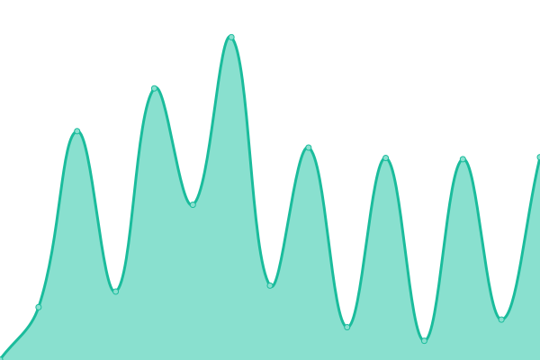
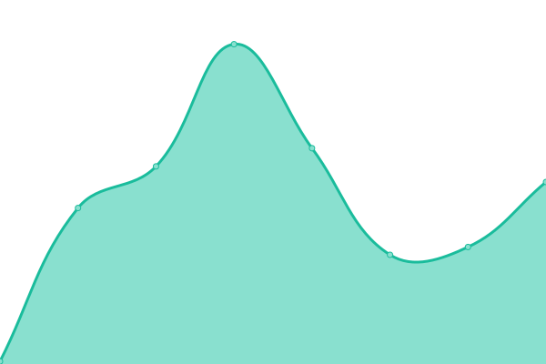
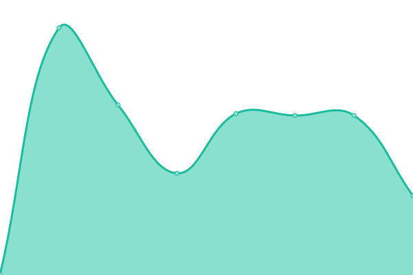
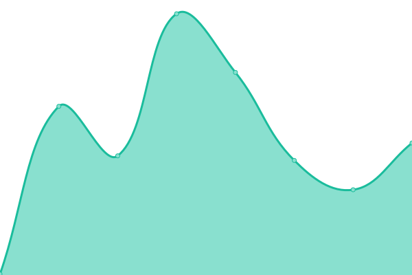

# [📈 Live Status](https://NoCodeKR.github.io/upptime): <!--live status--> **🟩 All systems operational**

This repository contains the open-source uptime monitor and status page for [노코드 코리아](https://NoCodeKR.github.io/upptime), powered by [Upptime](https://github.com/upptime/upptime).

With [Upptime](https://upptime.js.org), you can get your own unlimited and free uptime monitor and status page, powered entirely by a GitHub repository. We use [Issues](https://github.com/NoCodeKR/upptime/issues) as incident reports, [Actions](https://github.com/NoCodeKR/upptime/actions) as uptime monitors, and [Pages](https://NoCodeKR.github.io/upptime) for the status page.

<!--start: status pages-->
<!-- This summary is generated by Upptime (https://github.com/upptime/upptime) -->
<!-- Do not edit this manually, your changes will be overwritten -->
<!-- prettier-ignore -->
| URL | Status | History | Response Time | Uptime |
| --- | ------ | ------- | ------------- | ------ |
|  [Bubble](https://bubble.io/) | 🟩 Up | [bubble.yml](https://github.com/NoCodeKR/upptime/commits/HEAD/history/bubble.yml) | 

 423ms
     
 | 

<a href="https://NoCodeKR.github.io/upptime/history/bubble">100.00%</a>
    

|  [Webflow](https://webflow.com/) | 🟩 Up | [webflow.yml](https://github.com/NoCodeKR/upptime/commits/HEAD/history/webflow.yml) | 

 405ms
     
 | 

<a href="https://NoCodeKR.github.io/upptime/history/webflow">100.00%</a>
    

|  [FlutterFlow](https://flutterflow.io/) | 🟩 Up | [flutter-flow.yml](https://github.com/NoCodeKR/upptime/commits/HEAD/history/flutter-flow.yml) | 

 142ms
     
 | 

<a href="https://NoCodeKR.github.io/upptime/history/flutter-flow">100.00%</a>
    

|  [Glide](https://www.glideapps.com/) | 🟩 Up | [glide.yml](https://github.com/NoCodeKR/upptime/commits/HEAD/history/glide.yml) | 

 173ms
     
 | 

<a href="https://NoCodeKR.github.io/upptime/history/glide">100.00%</a>
    

|  [Stacker](https://www.stackerhq.com/) | 🟩 Up | [stacker.yml](https://github.com/NoCodeKR/upptime/commits/HEAD/history/stacker.yml) | 

 94ms
     
 | 

<a href="https://NoCodeKR.github.io/upptime/history/stacker">100.00%</a>
    

|  [Softr](https://www.softr.io/) | 🟩 Up | [softr.yml](https://github.com/NoCodeKR/upptime/commits/HEAD/history/softr.yml) | 

 798ms
     
 | 

<a href="https://NoCodeKR.github.io/upptime/history/softr">100.00%</a>
    

|  [Adalo](https://www.adalo.com/) | 🟩 Up | [adalo.yml](https://github.com/NoCodeKR/upptime/commits/HEAD/history/adalo.yml) | 

 104ms
     
 | 

<a href="https://NoCodeKR.github.io/upptime/history/adalo">100.00%</a>
    

<!--end: status pages-->

[**Visit our status website →**](https://NoCodeKR.github.io/upptime)

## 📄 License

- Powered by: [Upptime](https://github.com/upptime/upptime)
- Code: [MIT](./LICENSE) © [노코드 코리아](https://NoCodeKR.github.io/upptime)
- Data in the `./history` directory: [Open Database License](https://opendatacommons.org/licenses/odbl/1-0/)
